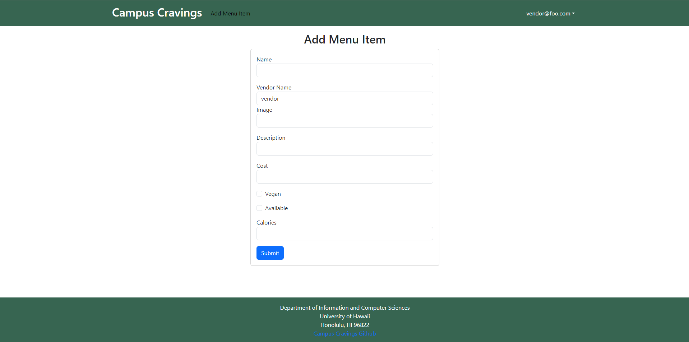
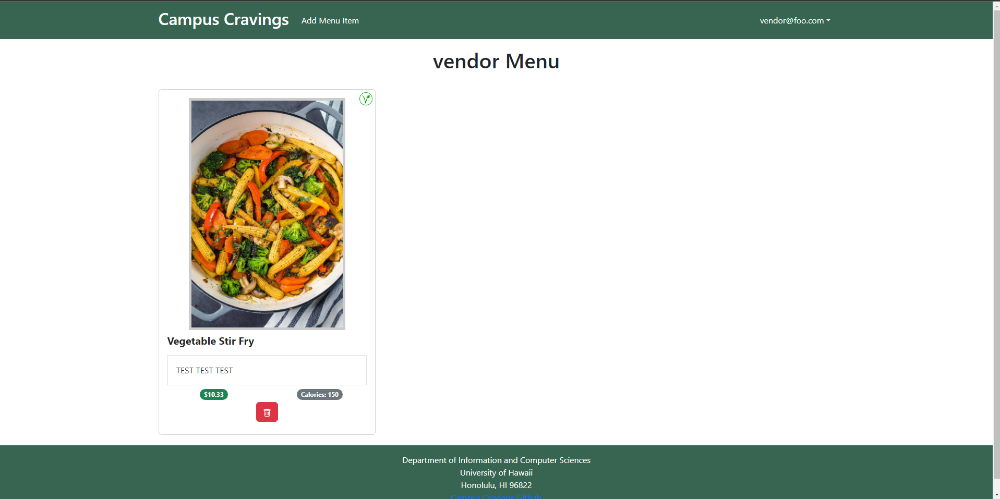

## Summary: 
"For the Final Project for ICS 314 my group decided to create a webpage called Campus Cravings.  Campus Cravings is a database of restaurants on and near the campus of UH Manoa which will include the names, location, menus, prices, hours of operation, and payment methods of each. This database will significantly benefit UH Manoa students by providing a convenient and easily accessible resource for all things related to on-campus dining. Including accounts for eatery owners will help maintain up-to-date and accurate restaurant information, enhancing the overall dining experience on campus."

I was responsible for creating the Menu Item schema and Pages for the vendors to add items and the users to view.
## Add Menu Item Page

This page posed several key challenges toughout its development but the main issue that I had was with linking the Vendors Account name to automatically set their add menu item location.  I struggled with finding a functional solution on my own so I discussed my issue with my groupmates.  We found a solution in a page one of the others had created where they used the users email name and cut the "@email.com" from the string to have the correct vendor string.  This showed a key example of using Design Patterns to help efficiently solve a problem by logging down a solution to a common issue. 

## Menu Item Page

## Learning Experience 
 Through the Campus Cravings project, you've gained substantial technical insights into Meteor development, frontend design, and MongoDB for database management. Working collaboratively on GitHub honed your project management skills, including CI implementation and issue-driven development. More than technical prowess, you've learned to adapt based on user feedback, considering various majors' perspectives and refining the UI/UX accordingly. This experience highlighted the importance of effective communication, problem-solving, and iterative development. Your ability to understand diverse user needs and document project progress reflects a well-rounded skill set, setting the stage for future enhancements like improved search, vendor profiles, and sorting options. Overall, Campus Cravings provided an immersive learning journey encompassing technical expertise and invaluable soft skills essential for software development.

Source: <a href="(https://campuscravings.github.io/)"><i class="large github icon "></i>Campus Cravings Project Page</a>
