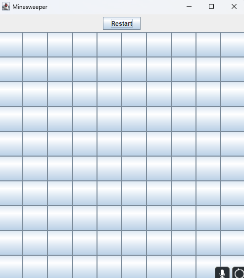

Trying to practice my knowledge of Jframe and other Java concepts, I attempted to recreate the game Minesweeper.  I used arrays to format and navigate the grid by changing values of the collumn or row values.

C
Source: <a href="[https://github.com/TravisQuesenberry/Minesweeper/tree/main](https://campuscravings.github.io/)"><i class="large github icon "></i>Campus Crabings Project Page</a>
