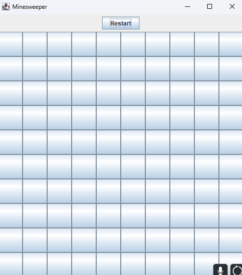

Trying to practice my knowledge of Jframe and other Java concepts, I attempted to recreate the game Minesweeper.  I used arrays to format and navigate the grid by changing values of the collumn or row values.

Changes to be made:

-Doesn't have "flagging" funtion.

-Doesn't inclide auto reveal of tiles with "0" value.

-No victory screen.

Source: <a href="https://github.com/TravisQuesenberry/Minesweeper/tree/main"><i class="large github icon "></i>TravisQuesenberry/MinesweeperGame</a>
