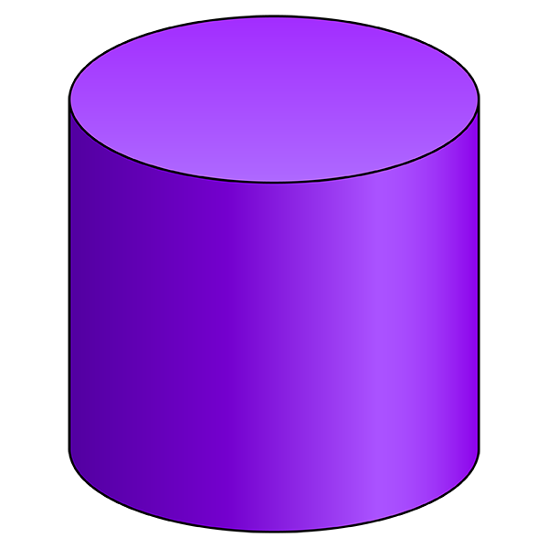

This C++ program defines two classes, Circle and Cylinder, to calculate the area of a circle and the surface area and volume of a cylinder with a given height. The program includes constructors, accessor methods, and mutator methods for setting and retrieving the radius and height of the shapes. It also includes error handling to ensure that negative or zero values are adjusted to valid values.

This project has significantly strengthened my C++ skills. Working on this program allowed me to gain a deeper understanding of object-oriented programming (OOP) concepts, as I had to create classes, constructors, and methods to encapsulate data and functionality. I learned how to handle errors gracefully, ensuring that the program can handle invalid input values effectively. Moreover, implementing inheritance between the Circle and Cylinder classes provided practical experience in leveraging OOP features to build more complex systems. Overall, this project has been a valuable learning experience, enhancing my proficiency in C++ and OOP.

Source: <a href="https://github.com/TravisQuesenberry/SurfaceArea"><i class="large github icon "></i>TravisQuesenberry/SurfaceArea</a>
